# AI-Powered Mental Stress Detection and Early Warning System

## Complete Technical Report

**Project Title:** AI-Powered Mental Stress Detection and Early Warning System  
**Technology Stack:** Django · React · PyTorch · Scikit-learn · PostgreSQL · Redis · Docker · AWS  
**Version:** 1.0.0  
**Author:** Rajneesh  
**Date:** May 2026  

---

> [!IMPORTANT]
> **Disclaimer:** This system is designed for research and informational purposes only. It is NOT a medical diagnostic tool. Always consult a licensed mental health professional for clinical guidance.

---

## Table of Contents

1. [Executive Summary](#1-executive-summary)
2. [Problem Statement & Motivation](#2-problem-statement--motivation)
3. [System Architecture Overview](#3-system-architecture-overview)
4. [Dataset Engineering](#4-dataset-engineering)
5. [NLP Text Preprocessing Pipeline](#5-nlp-text-preprocessing-pipeline)
6. [Feature Engineering](#6-feature-engineering)
7. [Machine Learning Models](#7-machine-learning-models)
8. [Ensemble Voting Strategy](#8-ensemble-voting-strategy)
9. [Model Evaluation & Results](#9-model-evaluation--results)
10. [Alert Engine & Early Warning System](#10-alert-engine--early-warning-system)
11. [Backend Architecture (Django REST)](#11-backend-architecture-django-rest)
12. [Frontend Architecture (React + Vite)](#12-frontend-architecture-react--vite)
13. [API Reference](#13-api-reference)
14. [Database Schema](#14-database-schema)
15. [Containerization (Docker)](#15-containerization-docker)
16. [CI/CD Pipeline (GitHub Actions)](#16-cicd-pipeline-github-actions)
17. [AWS Cloud Deployment](#17-aws-cloud-deployment)
18. [Security Considerations](#18-security-considerations)
19. [Performance Optimization](#19-performance-optimization)
20. [Future Enhancements](#20-future-enhancements)
21. [Appendix A: File Structure](#appendix-a-file-structure)
22. [Appendix B: Environment Variables](#appendix-b-environment-variables)
23. [Appendix C: Dependency Manifest](#appendix-c-dependency-manifest)

---

## 1. Executive Summary

The **AI Mental Stress Detection System** is a full-stack, production-grade web application that leverages Natural Language Processing (NLP) and machine learning to analyze user-submitted text for indicators of mental stress, emotional distress, and psychological disorders. The platform classifies text across **7 thematic mental health categories** using an ensemble of three machine learning models — **Support Vector Machine (SVM)**, **Random Forest (RF)**, and **Bidirectional Long Short-Term Memory (BiLSTM)** — combined through weighted majority voting.

The system assigns a **severity score from 1 (Minimal) to 5 (Critical)** and triggers real-time alerts with crisis resources when high-severity conditions are detected. An optional **LLM integration** (OpenAI/Gemini) generates empathetic, context-aware responses for distressed users.

### Key Capabilities

| Capability | Description |
|:---|:---|
| **7-Class Thematic Classification** | Normal, Depression, Suicidal, Anxiety, Bipolar, Stress, Personality Disorder |
| **Ensemble Prediction** | Weighted probability averaging across SVM + RF + BiLSTM |
| **5-Level Severity Scoring** | Deterministic mapping from predicted class to severity (1–5) |
| **Real-Time Alert Engine** | Triggers at severity ≥ 4 with crisis hotline resources |
| **Analysis History** | Full persistence with filtering, search, and pagination |
| **Model Comparison Dashboard** | 5-fold cross-validation metrics with visual comparison |
| **Production Deployment** | Dockerized, CI/CD automated, running on AWS EC2 |

### Technology Stack Summary

```
┌─────────────────────────────────────────────────────────┐
│                    FRONTEND (React 18)                  │
│  Vite · React Router · Axios · Chart.js · Lucide Icons  │
├─────────────────────────────────────────────────────────┤
│                   REVERSE PROXY (Nginx)                 │
│            SPA Routing · API Proxying · Gzip            │
├─────────────────────────────────────────────────────────┤
│               BACKEND (Django 4.2 + DRF)                │
│  Gunicorn · drf-spectacular · django-filter · CORS      │
├─────────────────────────────────────────────────────────┤
│                ML ENGINE (Python 3.11)                  │
│  Scikit-learn · PyTorch · NLTK · NumPy · SciPy          │
├─────────────────────────────────────────────────────────┤
│              DATA LAYER (PostgreSQL + Redis)            │
│  Persistent Storage · Query Caching · Session Store     │
├─────────────────────────────────────────────────────────┤
│           INFRASTRUCTURE (Docker + AWS EC2)             │
│  Docker Compose · GitHub Actions CI/CD · Swap Memory    │
└─────────────────────────────────────────────────────────┘
```

---

## 2. Problem Statement & Motivation

### 2.1 The Mental Health Crisis

Mental health disorders affect approximately **1 in 4 people** globally. The WHO estimates that depression alone affects over 280 million people worldwide, and suicide is the fourth leading cause of death among 15–29-year-olds. Despite the prevalence, a significant gap exists between those who need help and those who receive it — known as the **treatment gap**.

### 2.2 The Role of Social Media & Text

People increasingly express their emotional states through digital text — social media posts, journal entries, chat messages, and forum discussions. These textual expressions contain rich linguistic markers that can indicate underlying psychological distress. Patterns such as:

- **Hopelessness language** ("nothing matters", "no point")
- **Negative self-reference** ("I'm worthless", "I can't do anything right")
- **Absolutist thinking** ("always", "never", "everyone hates me")
- **Social withdrawal cues** ("I don't want to talk to anyone")

...can be computationally identified and classified using NLP techniques.

### 2.3 Project Objective

This project aims to build an **automated, real-time text analysis system** that:

1. **Classifies** user-submitted text into one of 7 mental health thematic categories
2. **Assigns severity** on a 1–5 scale based on the classification
3. **Triggers alerts** with crisis resources when high-severity distress is detected
4. **Compares models** transparently so users understand classification confidence
5. **Persists history** for longitudinal trend analysis
6. **Deploys to production** with full CI/CD automation on cloud infrastructure

---

## 3. System Architecture Overview

### 3.1 High-Level Architecture Diagram

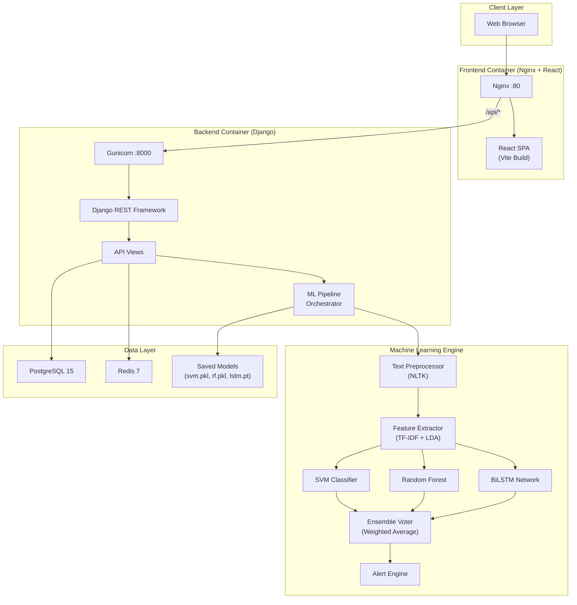

### 3.2 Request Flow (End-to-End)

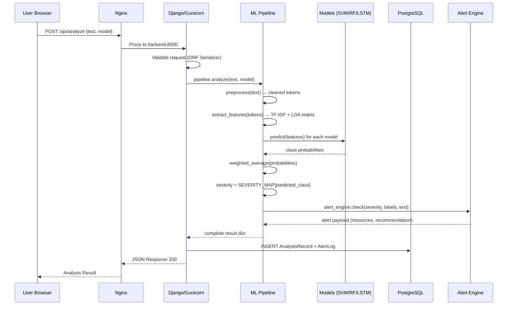

### 3.3 Component Responsibilities

| Component | Technology | Responsibility |
|:---|:---|:---|
| **Nginx** | nginx:alpine | Reverse proxy, SPA routing, static file serving, gzip |
| **React SPA** | React 18 + Vite 5 | User interface, form handling, data visualization |
| **Django API** | Django 4.2 + DRF 3.15 | REST API, request validation, data persistence |
| **ML Pipeline** | Python 3.11 | Orchestrates preprocessing → features → inference → alert |
| **PostgreSQL** | PostgreSQL 15 Alpine | Persistent storage for analysis records and alert logs |
| **Redis** | Redis 7 Alpine | API response caching, session storage |
| **Docker** | Docker Compose | Container orchestration for all services |

---

## 4. Dataset Engineering

### 4.1 Data Sources

The training pipeline merges **three distinct datasets** to create a robust, multi-class corpus:

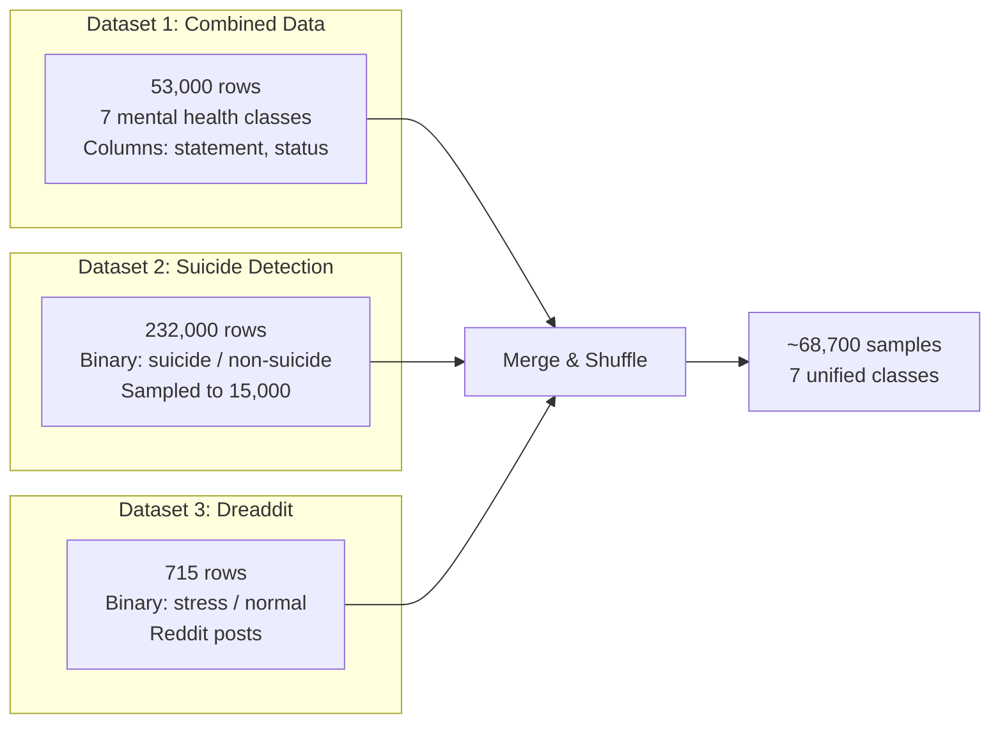

### 4.2 Dataset Details

| Dataset | Records | Original Labels | Mapped Labels | Source |
|:---|:---|:---|:---|:---|
| **Combined Data.csv** | 53,000 | Normal, Depression, Suicidal, Anxiety, Bipolar, Stress, Personality disorder | Direct mapping (7 classes) | Multi-source mental health corpus |
| **Suicide_Detection.csv** | 232,000 → **15,000** (sampled) | suicide, non-suicide | Suicidal, Normal | Reddit posts |
| **Dreaddit** | 715 | 1 (stressed), 0 (not stressed) | Stress, Normal | Reddit stress analysis |

### 4.3 Label Taxonomy (7-Class)

| Class | Severity | Description |
|:---|:---|:---|
| **Normal** | 1 (Minimal) | No significant stress indicators |
| **Personality Disorder** | 2 (Mild) | Personality-related behavioral patterns |
| **Stress** | 3 (Moderate) | General stress, burnout, pressure |
| **Anxiety** | 3 (Moderate) | Anxiety, panic, worry patterns |
| **Bipolar** | 4 (High) | Mood cycling, manic/depressive episodes |
| **Depression** | 4 (High) | Hopelessness, loss of interest, sadness |
| **Suicidal** | 5 (Critical) | Suicidal ideation, self-harm indicators |

### 4.4 Sampling Strategy

The Suicide Detection dataset (232k rows) vastly outnumbers other datasets. To prevent class domination:
- **7,500 suicide** samples and **7,500 non-suicide** samples are randomly drawn (balanced binary sampling)
- The final merged dataset is shuffled with `random_state=42` for reproducibility
- An 80/20 stratified train/test split preserves class distribution

---

## 5. NLP Text Preprocessing Pipeline

### 5.1 Pipeline Stages

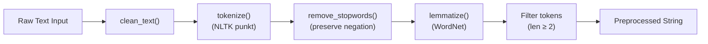

### 5.2 Cleaning Operations

| Step | Technique | Example |
|:---|:---|:---|
| Lowercasing | `text.lower()` | "I Feel HOPELESS" → "i feel hopeless" |
| URL removal | Regex `https?://\S+` | "check https://example.com" → "check" |
| HTML tag removal | Regex `<[^>]+>` | "`<b>`bold`</b>`" → "bold" |
| @mention removal | Regex `@\w+` | "@friend help me" → "help me" |
| Hashtag handling | Keep word after # | "#depression is real" → "depression is real" |
| Contraction expansion | Dictionary mapping | "can't" → "cannot", "won't" → "will not" |
| Punctuation removal | Regex `[^\w\s]` | "help!!!" → "help" |
| Digit removal | Regex `\d+` | "lost $500" → "lost" |
| Whitespace collapse | Regex `\s+` | Multiple spaces → single space |

### 5.3 Negation Preservation

Standard stopword removal eliminates words like "not", "no", "never" — which are **critical for sentiment analysis**. The system preserves 25 negation words:

```
no, not, nor, never, neither, nobody, nothing, nowhere, cannot,
can't, won't, don't, doesn't, didn't, isn't, aren't, wasn't,
weren't, haven't, hasn't, hadn't, wouldn't, couldn't, shouldn't
```

### 5.4 Example Transformation

```
Input:  "I can't stop worrying about my job deadline. My heart is racing!!!"
Output: "cannot stop worrying job deadline heart racing"
```

---

## 6. Feature Engineering

### 6.1 Dual-Feature Architecture

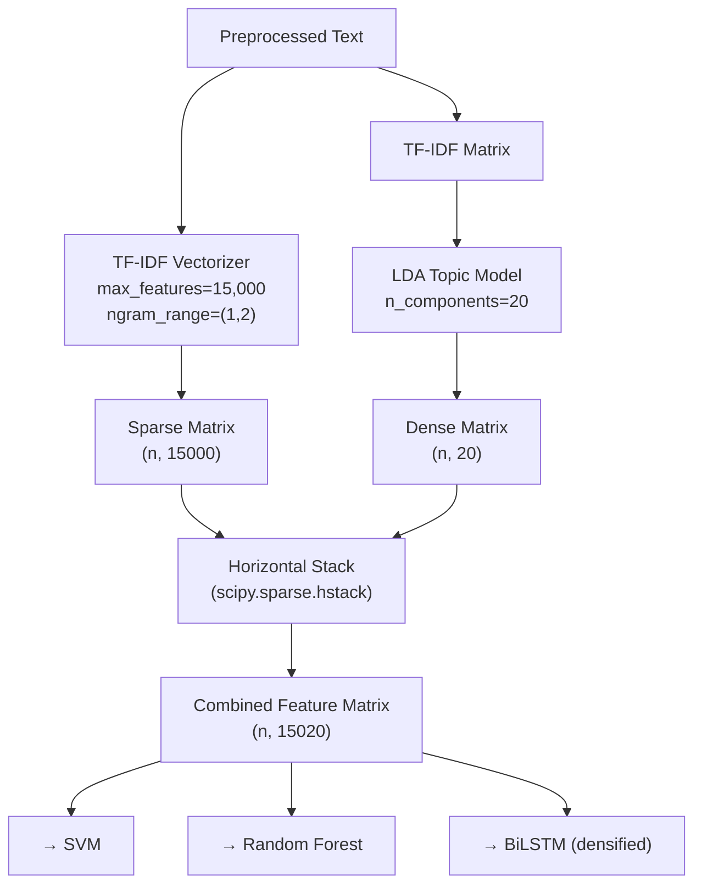

### 6.2 TF-IDF Configuration

| Parameter | Value | Rationale |
|:---|:---|:---|
| `max_features` | 15,000 | Vocabulary cap balancing coverage vs. dimensionality |
| `ngram_range` | (1, 2) | Unigrams + bigrams capture phrases like "not happy" |
| `sublinear_tf` | True | Logarithmic TF dampening reduces impact of frequent terms |
| `min_df` | 2 | Ignore terms appearing in fewer than 2 documents |
| `max_df` | 0.95 | Ignore terms appearing in >95% of documents |
| `token_pattern` | `\b[a-zA-Z][a-zA-Z]+\b` | Words only (no numbers, no single chars) |

### 6.3 LDA Topic Modeling

Latent Dirichlet Allocation extracts **20 latent topics** from the corpus, providing a dense, semantic representation that complements the sparse TF-IDF vectors.

| Parameter | Value |
|:---|:---|
| `n_components` | 20 |
| `max_iter` | 20 |
| `learning_method` | online |
| `learning_offset` | 50.0 |
| `random_state` | 42 |

---

## 7. Machine Learning Models

### 7.1 Model Architecture Comparison

```mermaid
graph TB
    subgraph SVM_Arch ["Model 1: SVM"]
        SVM_IN["TF-IDF + LDA<br/>(15,020 features)"] --> SVM_LIN["LinearSVC<br/>C=1.0, max_iter=3000"]
        SVM_LIN --> SVM_CAL["CalibratedClassifierCV<br/>(Platt Scaling, cv=3)"]
        SVM_CAL --> SVM_OVR["OneVsRestClassifier"]
        SVM_OVR --> SVM_OUT["7-class probabilities"]
    end

    subgraph RF_Arch ["Model 2: Random Forest"]
        RF_IN["TF-IDF + LDA<br/>(15,020 features)"] --> RF_CLF["RandomForestClassifier<br/>n_estimators=200<br/>class_weight=balanced"]
        RF_CLF --> RF_OUT["7-class probabilities"]
    end

    subgraph LSTM_Arch ["Model 3: BiLSTM"]
        LSTM_IN["TF-IDF + LDA<br/>(densified)"] --> LSTM_PROJ["Linear Projection<br/>15020 → 256"]
        LSTM_PROJ --> LSTM_NORM["LayerNorm + ReLU<br/>+ Dropout(0.3)"]
        LSTM_NORM --> LSTM_RNN["Bidirectional LSTM<br/>2-layer, hidden=256"]
        LSTM_RNN --> LSTM_HEAD["FC: 512→128→ReLU→7<br/>+ Dropout(0.2)"]
        LSTM_HEAD --> LSTM_OUT["7-class logits<br/>→ softmax"]
    end
```

### 7.2 SVM (Support Vector Machine)

**Architecture:** `OneVsRestClassifier(CalibratedClassifierCV(LinearSVC))`

| Hyperparameter | Value | Purpose |
|:---|:---|:---|
| C | 1.0 | Regularization strength |
| max_iter | 3,000 | Maximum optimization iterations |
| class_weight | balanced | Automatic class-weight adjustment |
| Calibration | CalibratedClassifierCV (cv=3) | Platt scaling for probability estimates |

**Strengths:** Fast training, memory-efficient, excellent for high-dimensional sparse features  
**Model File:** `svm.pkl` (2.5 MB)

### 7.3 Random Forest

**Architecture:** `RandomForestClassifier` with 200 decision trees

| Hyperparameter | Value | Purpose |
|:---|:---|:---|
| n_estimators | 200 | Number of decision trees |
| max_depth | None | Trees grow until pure leaves |
| min_samples_leaf | 2 | Minimum samples per leaf node |
| class_weight | balanced | Automatic class-weight adjustment |
| random_state | 42 | Reproducibility |

**Strengths:** Robust to noise, handles feature interactions, provides feature importance  
**Model File:** `rf.pkl` (262 MB)

### 7.4 BiLSTM (Bidirectional LSTM)

**Architecture:** Custom `StressNet` PyTorch module

```
Input (15,020) → Linear(15020, 256) → LayerNorm → ReLU → Dropout(0.3)
    → unsqueeze(1) → [sequence of length 1]
    → BiLSTM(256, 256, layers=2, bidirectional=True, dropout=0.3)
    → take last output → (512-dim)
    → Linear(512, 128) → ReLU → Dropout(0.2) → Linear(128, 7)
    → Softmax → 7-class probabilities
```

| Hyperparameter | Value |
|:---|:---|
| input_dim | 15,020 |
| hidden_dim | 256 |
| num_layers | 2 |
| bidirectional | True |
| dropout | 0.3 |
| optimizer | AdamW (lr=1e-3, weight_decay=1e-4) |
| scheduler | OneCycleLR |
| loss | CrossEntropyLoss with balanced class weights |
| epochs | 15 |
| batch_size | 128 |
| gradient clipping | max_norm=1.0 |

**Strengths:** Captures complex non-linear patterns, best F1 score  
**Model File:** `lstm.pt` (26 MB)

---

## 8. Ensemble Voting Strategy

### 8.1 Weighted Probability Averaging

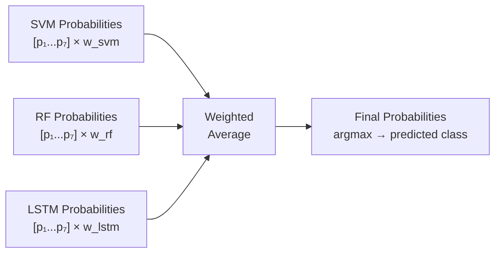

**Formula:**

```
P_ensemble(class_i) = Σ(w_model × P_model(class_i)) / Σ(w_model)
```

Where `w_model` is the **validation F1 score** of each model, stored in `model_weights.pkl` after training.

### 8.2 Graceful Degradation

If a model file is missing or fails to load, the ensemble automatically excludes it and recalculates weights using only available models. The system logs a warning but continues to serve predictions.

---

## 9. Model Evaluation & Results

### 9.1 Evaluation Methodology

- **Strategy:** Stratified 5-Fold Cross-Validation
- **Stratification:** On primary thematic label
- **Metrics:** Micro-averaged Accuracy, Precision, Recall, F1-Score
- **Stability:** Standard Deviation and Coefficient of Variation (CV%)

### 9.2 Results Table

| Model | Accuracy | Precision | Recall | F1-Score | CV% (F1) |
|:---|:---|:---|:---|:---|:---|
| **SVM** | 0.3275 ± 0.0246 | 0.8252 ± 0.0231 | 0.3288 ± 0.0258 | 0.4695 ± 0.0271 | 5.78% |
| **RF** | 0.2475 ± 0.0448 | 0.7970 ± 0.0612 | 0.2487 ± 0.0434 | 0.3779 ± 0.0542 | 14.35% |
| **LSTM** | **0.4875 ± 0.0177** | 0.6942 ± 0.0357 | **0.4888 ± 0.0191** | **0.5734 ± 0.0231** | **4.03%** |

### 9.3 Key Observations

1. **LSTM achieves the highest F1 (0.5734)** and the most stable performance (CV% = 4.03%)
2. **SVM has the highest precision (0.8252)** — when it predicts a class, it's usually correct
3. **Random Forest shows the most variance** (CV% = 14.35%) — less stable across folds
4. The **ensemble** leverages SVM's precision and LSTM's recall for balanced performance


---

## 10. Alert Engine & Early Warning System

### 10.1 Severity Mapping

The system uses a **deterministic severity mapping** from the predicted thematic class:

| Predicted Class | Severity Level | Status | Color | Action |
|:---|:---|:---|:---|:---|
| Normal | 1 | Minimal | 🟢 `#10b981` | No action needed |
| Personality Disorder | 2 | Mild | 🟡 `#84cc16` | Self-care suggestions |
| Stress / Anxiety | 3 | Moderate | 🟠 `#f59e0b` | Recommend talking to someone |
| Bipolar / Depression | 4 | High | 🔴 `#ef4444` | **Alert triggered** — professional help recommended |
| Suicidal | 5 | Critical | 🆘 `#dc2626` | **Alert triggered** — crisis resources displayed |

### 10.2 Alert Flow

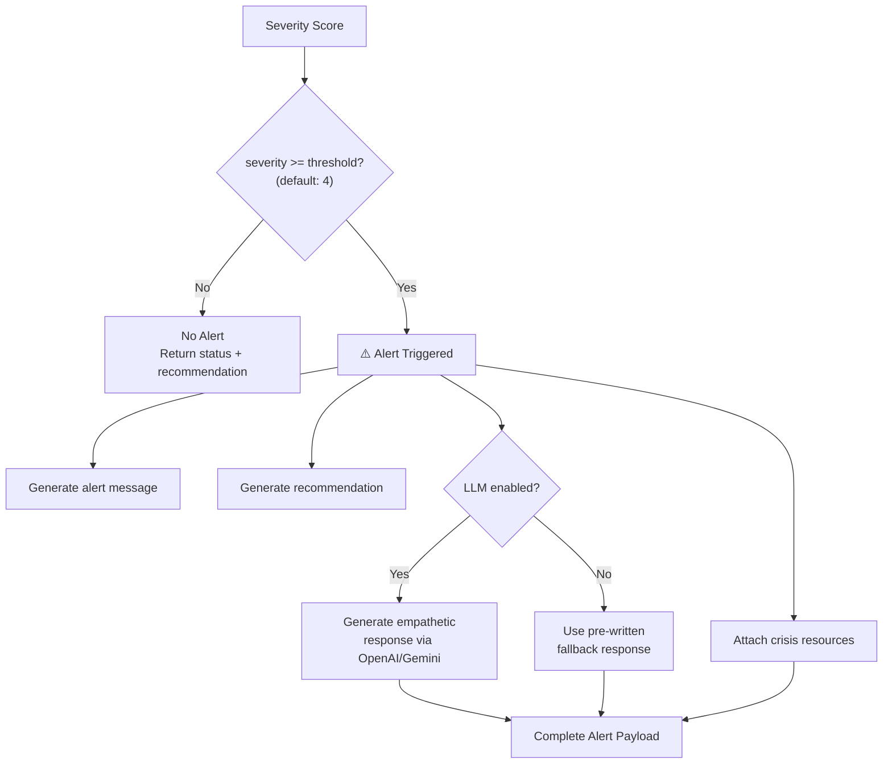

### 10.3 Crisis Resources

When severity ≥ 4, the following resources are automatically included:

| Resource | Contact | Type |
|:---|:---|:---|
| iCall (India) | 9152987821 | Phone |
| Vandrevala Foundation Helpline | 1860-2662-345 | Phone |
| 988 Lifeline (USA) | 988 | Phone |
| Crisis Text Line (USA) | Text HOME to 741741 | Text |

### 10.4 LLM Integration (Optional)

When `ML_LLM_ENABLED=true` and an API key is configured, the alert engine generates empathetic responses using a carefully crafted system prompt with safety rules:

1. Never provide medical diagnoses
2. Always encourage professional help
3. Never minimize feelings
4. Keep responses under 100 words
5. End with gentle encouragement

---

## 11. Backend Architecture (Django REST)

### 11.1 Django Project Structure

```
backend/
├── config/                     # Project configuration
│   ├── settings/
│   │   ├── base.py             # Shared settings (DRF, CORS, Cache, ML)
│   │   ├── development.py      # SQLite, DEBUG=True
│   │   └── production.py       # PostgreSQL, Redis, DEBUG=False
│   ├── urls.py                 # Root URL routing
│   └── wsgi.py                 # WSGI entry point
├── apps/
│   ├── analysis/               # Core analysis application
│   │   ├── models.py           # AnalysisRecord, AlertLog
│   │   ├── views.py            # API views (6 endpoints)
│   │   ├── serializers.py      # DRF serializers
│   │   ├── urls.py             # URL routing
│   │   ├── admin.py            # Django admin registration
│   │   └── tests.py            # Unit tests
│   └── health/                 # Health check application
│       └── views.py            # /api/health endpoint
├── ml/                         # Machine learning module
│   ├── pipeline.py             # Analysis orchestrator
│   ├── preprocessor.py         # NLP text cleaning
│   ├── feature_extractor.py    # TF-IDF + LDA
│   ├── trainer.py              # Model training script
│   ├── evaluator.py            # Cross-validation evaluation
│   ├── alert_engine.py         # Early warning system
│   └── models/
│       ├── svm_model.py        # SVM classifier wrapper
│       ├── rf_model.py         # Random Forest wrapper
│       └── lstm_model.py       # BiLSTM PyTorch wrapper
├── saved_models/               # Serialized model weights
│   ├── svm.pkl                 # 2.5 MB
│   ├── rf.pkl                  # 262 MB
│   ├── lstm.pt                 # 26 MB
│   ├── tfidf_vectorizer.pkl    # 588 KB
│   ├── lda_model.pkl           # 4.8 MB
│   ├── label_encoders.pkl      # 775 B
│   └── model_weights.pkl       # 61 B (F1 scores for ensemble)
└── requirements.txt            # Python dependencies
```

### 11.2 Django Settings Architecture

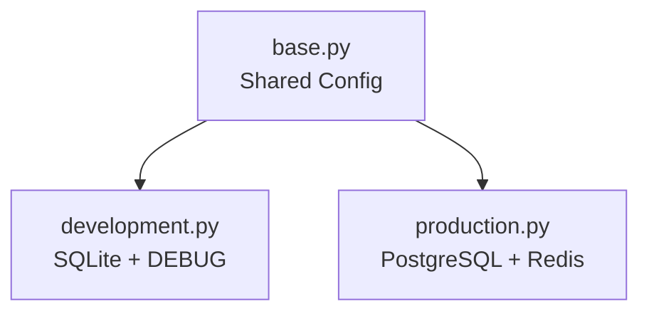

**Base settings include:**
- REST Framework with pagination (20 per page), filtering, ordering, search
- drf-spectacular for OpenAPI/Swagger documentation
- CORS configuration
- ML pipeline settings (`ML_DEFAULT_MODEL`, `ML_ALERT_THRESHOLD`, `ML_LLM_ENABLED`)

**Production overrides:**
- PostgreSQL database connection
- Redis cache backend (django-redis)
- Secure cookies and SSL proxy headers

### 11.3 Singleton Pipeline Pattern

The ML pipeline uses a **module-level singleton** to avoid reloading heavy model files on every request:

```python
_pipeline_instance = None

def get_pipeline(alert_threshold=4):
    global _pipeline_instance
    if _pipeline_instance is None:
        _pipeline_instance = AnalysisPipeline(...)
    return _pipeline_instance
```

Models are **lazily loaded** — only loaded into memory on first use, reducing startup time.

---

## 12. Frontend Architecture (React + Vite)

### 12.1 Frontend Structure

```
frontend/src/
├── App.jsx                     # Root component + React Router
├── main.jsx                    # Entry point
├── index.css                   # Global design system (CSS variables)
├── components/
│   ├── Navbar.jsx              # Navigation bar
│   ├── TextInput.jsx           # Analysis input form + model selector
│   ├── AnalysisResult.jsx      # Full result display card
│   ├── SeverityMeter.jsx       # Animated SVG arc gauge
│   ├── LabelTags.jsx           # Label tag display with scores
│   ├── AlertBanner.jsx         # Crisis alert banner
│   ├── ModelCompare.jsx        # Model comparison chart
│   └── TrendChart.jsx          # Severity trend line chart
├── pages/
│   ├── Dashboard.jsx           # Main analysis page
│   ├── History.jsx             # Paginated history with filters
│   └── Compare.jsx             # Model comparison view
├── services/
│   └── api.js                  # Axios API client
└── hooks/
    └── useAnalysis.js          # Custom React hook for analysis state
```

### 12.2 Component Architecture

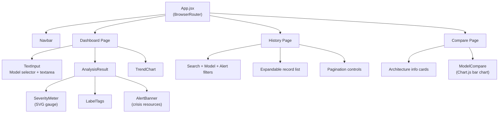

### 12.3 API Service Layer

The frontend communicates with the backend through a centralized Axios client with:
- Base URL from `VITE_API_BASE` environment variable (defaults to `/api`)
- 60-second timeout for ML inference requests
- Unified error interceptor extracting `error` or `detail` from responses

**Available API functions:**

| Function | Method | Endpoint | Purpose |
|:---|:---|:---|:---|
| `analyzeText()` | POST | `/api/analyze` | Submit text for analysis |
| `fetchHistory()` | GET | `/api/history` | Paginated history with filters |
| `fetchHistoryDetail()` | GET | `/api/history/:id/` | Single record detail |
| `fetchModelComparison()` | GET | `/api/compare` | Model CV metrics |
| `fetchStats()` | GET | `/api/stats` | Dashboard aggregate stats |
| `updateThreshold()` | POST | `/api/threshold` | Update alert threshold |
| `checkHealth()` | GET | `/api/health` | Service health check |

### 12.4 Design System

The frontend uses a dark-mode glassmorphism design with CSS custom properties:
- **Color palette:** Sky blue primary (`#0ea5e9`), Emerald accent (`#06d6a0`)
- **Typography:** Inter font family with monospace fallback
- **Cards:** Semi-transparent glass effect with backdrop blur
- **Animations:** Smooth transitions, fade-in-up effects, animated SVG gauges

---

## 13. API Reference

### 13.1 Endpoints

| Method | Endpoint | Description |
|:---|:---|:---|
| `POST` | `/api/analyze` | Analyze text for mental stress |
| `GET` | `/api/history` | List analysis history (paginated) |
| `GET` | `/api/history/:id/` | Get single analysis record |
| `GET` | `/api/compare` | Model comparison metrics |
| `GET` | `/api/stats` | Dashboard statistics |
| `POST` | `/api/threshold` | Update alert threshold |
| `GET` | `/api/health` | Service health check |
| `GET` | `/api/docs/` | Swagger UI documentation |
| `GET` | `/api/redoc/` | ReDoc documentation |
| `GET` | `/api/schema/` | OpenAPI 3.0 JSON schema |

### 13.2 POST /api/analyze — Request

```json
{
  "text": "I feel completely hopeless and lost...",
  "model": "ensemble",
  "threshold": 0.5
}
```

| Field | Type | Required | Default | Description |
|:---|:---|:---|:---|:---|
| `text` | string | Yes | — | Text to analyze (5–2000 chars) |
| `model` | string | No | `ensemble` | One of: `svm`, `rf`, `lstm`, `ensemble` |
| `threshold` | float | No | 0.5 | Classification threshold (0.1–0.9) |

### 13.3 POST /api/analyze — Response

```json
{
  "success": true,
  "record_id": 42,
  "text_preview": "I feel completely hopeless and lost...",
  "model_used": "ensemble (svm, rf, lstm)",
  "processing_time_ms": 187.3,
  "thematic_labels": ["Depression"],
  "thematic_scores": {
    "Normal": 0.0412,
    "Depression": 0.6831,
    "Suicidal": 0.1205,
    "Anxiety": 0.0523,
    "Bipolar": 0.0398,
    "Stress": 0.0321,
    "Personality Disorder": 0.0310
  },
  "severity": 4,
  "confidence_score": 0.6831,
  "alert": {
    "severity": 4,
    "severity_status": "high",
    "alert_triggered": true,
    "alert_message": "⚠️ High stress indicators detected.",
    "recommendation": "We strongly recommend reaching out to a mental health professional.",
    "severity_color": "#ef4444",
    "severity_icon": "🔴",
    "resources": [
      {"name": "iCall (India)", "contact": "9152987821", "type": "phone"},
      {"name": "988 Lifeline (USA)", "contact": "988", "type": "phone"}
    ],
    "thematic_commentary": "Feelings of depression are valid and treatable.",
    "empathetic_response": null
  },
  "disclaimer": "⚠️ This tool is for research and informational purposes only."
}
```

---

## 14. Database Schema

### 14.1 Entity-Relationship Diagram

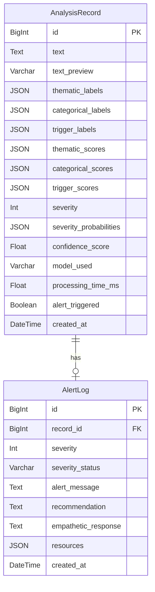

### 14.2 Database Indexes

| Table | Indexed Fields | Purpose |
|:---|:---|:---|
| AnalysisRecord | `created_at` | Fast chronological queries |
| AnalysisRecord | `severity` | Filter by severity level |
| AnalysisRecord | `alert_triggered` | Filter alert-only records |
| AnalysisRecord | `model_used` | Filter by model type |

---

## 15. Containerization (Docker)

### 15.1 Container Architecture

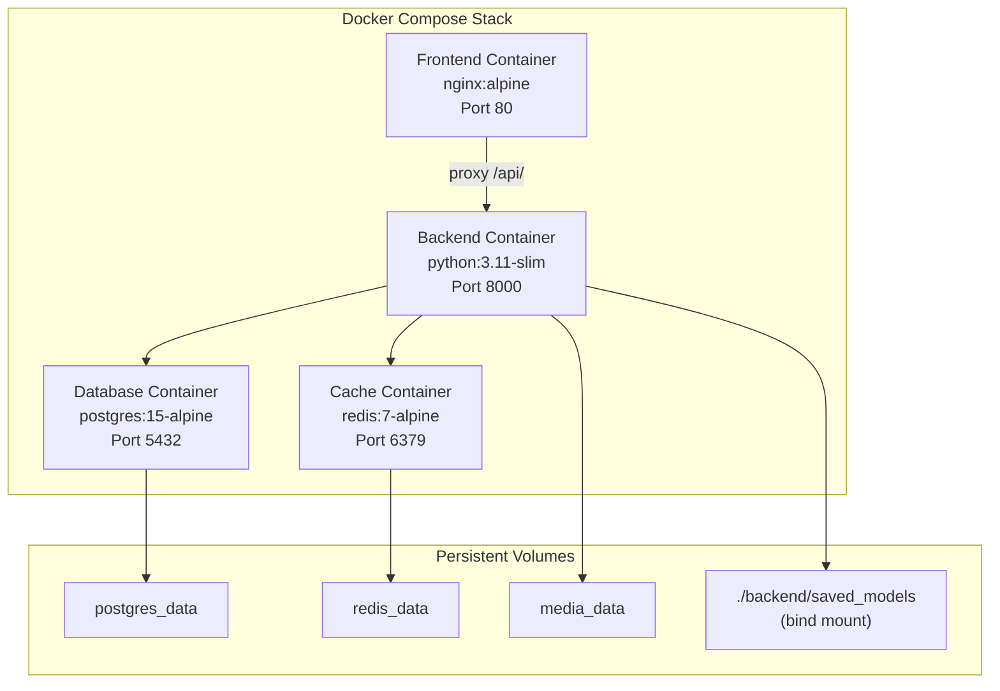

### 15.2 Backend Dockerfile (Multi-stage)

```
Stage 1 (Builder):
  python:3.11-slim → install build-essential, libpq-dev → pip install requirements

Stage 2 (Runtime):
  python:3.11-slim → copy packages from builder → install libpq5
  → copy backend source → download NLTK data → create directories
  → expose 8000 → run gunicorn
```

### 15.3 Frontend Dockerfile (Multi-stage)

```
Stage 1 (Builder):
  node:20-alpine → npm ci → copy source → npm run build

Stage 2 (Server):
  nginx:alpine → copy dist/ to /usr/share/nginx/html
  → copy nginx.conf → expose 80
```

### 15.4 Nginx Configuration

- SPA fallback: all routes → `index.html`
- API proxy: `/api/*` → `backend:8000`
- Static file caching: 1 year with `Cache-Control: public, immutable`
- Gzip compression enabled for text, CSS, JSON, JS
- Proxy read timeout: 120 seconds (for ML inference)

---

## 16. CI/CD Pipeline (GitHub Actions)

### 16.1 Pipeline Architecture

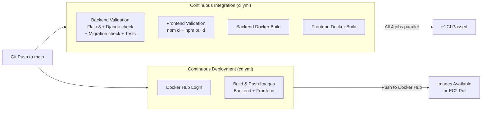

### 16.2 CI Jobs (4 parallel)

| Job | Steps |
|:---|:---|
| **Backend Validation** | Flake8 linting → Django check → Migration check → Unit tests |
| **Frontend Validation** | npm ci → npm run build |
| **Backend Docker Build** | Build Dockerfile.backend (no push, validation only) |
| **Frontend Docker Build** | Build Dockerfile.frontend (no push, validation only) |

### 16.3 CD Pipeline

Triggered on push to `main`/`master` or version tags (`v*.*.*`):
1. Log in to Docker Hub using `DOCKERHUB_USERNAME` and `DOCKERHUB_TOKEN` secrets
2. Extract metadata (tags: latest, semver, SHA)
3. Build and push `rjsh2407/nlp-project-backend:latest`
4. Build and push `rjsh2407/nlp-project-frontend:latest`

---

## 17. AWS Cloud Deployment

### 17.1 Infrastructure

| Resource | Configuration |
|:---|:---|
| **EC2 Instance** | Ubuntu 24.04 LTS, t3.medium (2 vCPU, 4 GB RAM) |
| **Elastic IP** | Static public IP for consistent access |
| **Security Group** | SSH (22), HTTP (80), HTTPS (443) |
| **Swap File** | 4 GB (for ML model memory overflow protection) |
| **Docker** | docker.io + docker-compose-v2 |

### 17.2 Deployment Flow

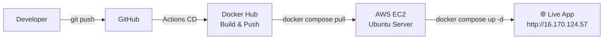

### 17.3 Production Environment Variables

```env
DOCKERHUB_USERNAME=rjsh2407
DJANGO_SECRET_KEY=<generated-hex-key>
ALLOWED_HOSTS=localhost,127.0.0.1,16.170.124.57
POSTGRES_DB=stressdb
POSTGRES_USER=stress_admin
POSTGRES_PASSWORD=<secure-password>
ML_DEFAULT_MODEL=ensemble
ML_ALERT_THRESHOLD=4
ML_LLM_ENABLED=false
```

---

## 18. Security Considerations

| Area | Implementation |
|:---|:---|
| **Secrets Management** | Environment variables via `.env` (gitignored), GitHub Secrets for CI/CD |
| **CSRF Protection** | Django CSRF middleware enabled |
| **Input Validation** | DRF serializers enforce min/max length, model choices, threshold range |
| **SQL Injection** | Django ORM parameterized queries |
| **CORS** | Configurable allowed origins |
| **SSH Access** | Key-based authentication only, restricted to admin IP |
| **Docker Security** | Non-root container processes, minimal Alpine base images |
| **SSL/TLS** | Let's Encrypt Certbot integration documented |
| **Cookie Security** | `SESSION_COOKIE_SECURE=True`, `CSRF_COOKIE_SECURE=True` in production |

---

## 19. Performance Optimization

| Optimization | Implementation |
|:---|:---|
| **Lazy Model Loading** | Models loaded on first request, cached in memory |
| **Singleton Pipeline** | Single pipeline instance reused across requests |
| **Redis Caching** | `/api/stats` cached 1 min, `/api/compare` cached 1 hour |
| **Multi-stage Docker** | Separate builder/runtime stages reduce image size |
| **Nginx Gzip** | Compress text, CSS, JSON, JS responses |
| **Static Caching** | 1-year cache headers for hashed Vite assets |
| **Database Indexes** | Indexed on created_at, severity, alert_triggered, model_used |
| **Swap Memory** | 4 GB swap file prevents OOM crashes on limited RAM |
| **Gunicorn Workers** | 2 sync workers with 120s timeout |

---

## 20. Future Enhancements

1. **Multilingual Support** — Extend NLP pipeline to support Hindi, Spanish, and other languages
2. **User Authentication** — Add JWT-based auth for personalized analysis history
3. **Transformer Models** — Integrate BERT/DistilBERT for improved classification accuracy
4. **Real-time Streaming** — WebSocket-based live text analysis as users type
5. **Mobile App** — React Native companion app
6. **Analytics Dashboard** — Admin-facing analytics with population-level insights
7. **A/B Model Testing** — Dynamic model selection based on real-time performance
8. **Federated Learning** — Privacy-preserving model training across institutions

---

## Appendix A: File Structure

```
AI-Mental-Stress-Detection-System/
├── .github/workflows/
│   ├── ci.yml                  # Continuous Integration pipeline
│   └── cd.yml                  # Continuous Deployment pipeline
├── backend/
│   ├── apps/analysis/          # Core analysis Django app
│   ├── apps/health/            # Health check endpoint
│   ├── config/settings/        # Django settings (base/dev/prod)
│   ├── ml/                     # Machine learning engine
│   ├── ml/models/              # SVM, RF, LSTM wrappers
│   ├── saved_models/           # Trained model weights
│   ├── manage.py
│   └── requirements.txt
├── frontend/
│   ├── src/components/         # 8 React components
│   ├── src/pages/              # 3 page components
│   ├── src/services/api.js     # API client
│   ├── src/hooks/              # Custom hooks
│   └── package.json
├── datasets/
│   ├── Combined Data.csv       # 31 MB
│   ├── Suicide_Detection.csv   # 167 MB
│   └── dreaddit_*.csv          # 685 KB
├── Dockerfile.backend          # Multi-stage Python build
├── Dockerfile.frontend         # Multi-stage Node+Nginx build
├── docker-compose.yml          # Local development
├── docker-compose.prod.yml     # Production deployment
├── nginx.conf                  # Reverse proxy config
├── .env                        # Environment variables
└── .dockerignore               # Docker build exclusions
```

---

## Appendix B: Environment Variables

| Variable | Default | Description |
|:---|:---|:---|
| `DJANGO_SECRET_KEY` | (required) | Django cryptographic signing key |
| `DJANGO_SETTINGS_MODULE` | `config.settings.development` | Settings module path |
| `POSTGRES_DB` | `stressdb` | Database name |
| `POSTGRES_USER` | `stress_user` | Database user |
| `POSTGRES_PASSWORD` | (required) | Database password |
| `REDIS_URL` | `redis://redis:6379/0` | Redis connection string |
| `ALLOWED_HOSTS` | `localhost,127.0.0.1` | Comma-separated allowed hosts |
| `CORS_ALLOW_ALL` | `true` | Allow all CORS origins |
| `ML_DEFAULT_MODEL` | `ensemble` | Default ML model |
| `ML_ALERT_THRESHOLD` | `4` | Alert trigger severity level |
| `ML_LLM_ENABLED` | `false` | Enable LLM empathetic responses |
| `OPENAI_API_KEY` | (optional) | OpenAI API key for LLM |
| `DOCKERHUB_USERNAME` | (required for prod) | Docker Hub username |

---

## Appendix C: Dependency Manifest

### Backend (Python 3.11)

| Package | Version | Purpose |
|:---|:---|:---|
| Django | ≥4.2 | Web framework |
| djangorestframework | ≥3.15 | REST API |
| drf-spectacular | ≥0.27 | OpenAPI documentation |
| django-cors-headers | ≥4.3 | CORS support |
| django-filter | ≥23.5 | Queryset filtering |
| psycopg2-binary | ≥2.9 | PostgreSQL adapter |
| gunicorn | ≥21.2 | WSGI HTTP server |
| python-decouple | ≥3.8 | Environment variable management |
| redis | ≥5.0 | Redis client |
| django-redis | ≥5.4 | Django Redis cache backend |
| nltk | ≥3.8 | NLP text processing |
| scikit-learn | ≥1.4 | SVM, RF, TF-IDF, LDA |
| scipy | ≥1.12 | Sparse matrix operations |
| numpy | ≥1.26 | Numerical computing |
| pandas | ≥2.2 | Data manipulation |
| torch | ≥2.2 | BiLSTM deep learning |
| matplotlib | ≥3.8 | Chart generation |
| openai | ≥1.12 | LLM integration |

### Frontend (Node.js 20)

| Package | Version | Purpose |
|:---|:---|:---|
| react | ^18.3.1 | UI library |
| react-dom | ^18.3.1 | DOM rendering |
| react-router-dom | ^6.22.3 | Client-side routing |
| axios | ^1.6.8 | HTTP client |
| chart.js | ^4.4.2 | Charts and graphs |
| react-chartjs-2 | ^5.2.0 | React Chart.js wrapper |
| framer-motion | ^11.1.7 | Animations |
| lucide-react | ^0.368.0 | Icon library |
| date-fns | ^3.6.0 | Date formatting |
| vite | ^5.2.0 | Build tool and dev server |

---

*End of Report*
