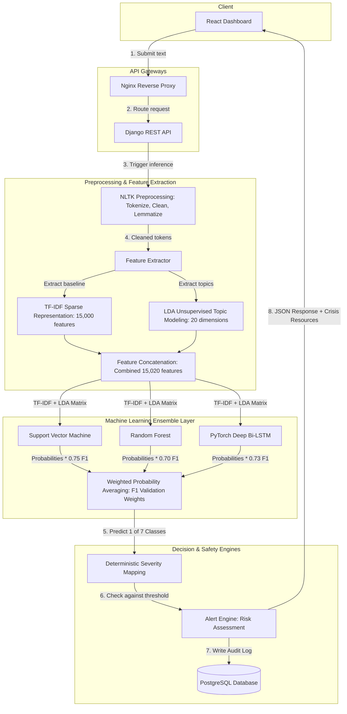

# 🧠 MindSense Q&A Session

This document stores the questions and answers from our interactive Q&A session regarding the MindSense AI Mental Stress Detection & Early Warning System.

---

## 📋 Table of Contents

1. [Unsupervised Machine Learning Approaches](#1-does-this-project-use-any-unsupervised-machine-learning-approach)
2. [NLP Techniques Utilized](#2-does-it-use-any-nlp-techniques)
3. [System Architecture Diagram](#3-system-architecture-diagram)
4. [Line-by-Line Model Code Explanation](#4-explain-the-purpose-behind-each-line-of-model-code)

---

## 💬 Questions & Answers

### 1. Does this project use any unsupervised machine learning approach?

**Yes.** MindSense uses **Latent Dirichlet Allocation (LDA)**, which is a classic unsupervised probabilistic topic modeling technique.

* **Where it is used:** Inside [feature_extractor.py](file:///home/rj/RajneeshCodes/NLP%20Project/backend/ml/feature_extractor.py).
* **How it works:**
  1. The preprocessed training texts are passed to a `LatentDirichletAllocation` model (from `scikit-learn`) configured to find exactly **20 latent topics** across the corpus without any manual labeling.
  2. For every input statement, LDA outputs a 20-dimensional vector representing the probability distribution of that statement belonging to each of the 20 topics.
  3. These unsupervised topic features are concatenated directly onto the TF-IDF representation, providing dense semantic clues (e.g., words commonly grouped under "work stress", "substance use", etc.) to help the Random Forest and LSTM classifiers make better predictions.

---

### 2. Does it use any NLP techniques?

**Yes, extensively.** MindSense is a full-featured NLP pipeline. It uses the following sequential techniques:

1. **Text Preprocessing & Cleaning (in [preprocessor.py](file:///home/rj/RajneeshCodes/NLP%20Project/backend/ml/preprocessor.py)):**
   * **Lowercasing:** Standardizes all input characters to lowercase to prevent capitalization mismatching.
   * **Regex Cleaning:** Strips out web links, emails, usernames, special punctuation, and excess whitespace.
   * **Tokenization:** Splits paragraphs into individual words (tokens) using NLTK's word tokenizer.
   * **Stopwords Removal:** Filters out high-frequency words that contain no emotional/semantic sentiment (e.g., "the", "is", "at") using NLTK's English stopword dictionary.
   * **Lemmatization:** Uses NLTK's `WordNetLemmatizer` to reduce inflected words to their base dictionary forms (e.g., "running", "ran", "runs" all become "run") to consolidate features.

2. **Feature Representation & Vectorization (in [feature_extractor.py](file:///home/rj/RajneeshCodes/NLP%20Project/backend/ml/feature_extractor.py)):**
   * **TF-IDF (Term Frequency-Inverse Document Frequency):** Translates words into numerical weights, emphasizing words that are uniquely descriptive within a post while penalizing words common to every single post. MindSense constructs a **15,000-dimensional sparse feature space**.
   * **Unsupervised Topic Clustering (LDA):** Discussed in Question 1.

---

### 3. System Architecture Diagram

Below is the complete architectural flow of MindSense, representing the request lifecycle, parallel feature extraction, ensemble classifier, and the safety alert engine:



---

### 4. Explain the purpose behind each line of model code

Here is the line-by-line explanation of our model architectures.

#### A. The Deep Learning Model: PyTorch `StressNet` (LSTM)
Defined in [trainer.py](file:///home/rj/RajneeshCodes/NLP%20Project/backend/ml/trainer.py) and [pipeline.py](file:///home/rj/RajneeshCodes/NLP%20Project/backend/ml/pipeline.py):

```python
class StressNet(nn.Module):
```
* **Purpose:** Declares a custom neural network class inheriting from PyTorch's `nn.Module` base class, granting it network parameter tracking and backpropagation mechanics.

```python
    def __init__(self):
        super().__init__()
```
* **Purpose:** Calls the parent constructor (`nn.Module`) to initialize default PyTorch layers, buffers, and tracking parameters.

```python
        self.proj = nn.Sequential(
            nn.Linear(input_dim, hidden_dim),
            nn.LayerNorm(hidden_dim),
            nn.ReLU(),
            nn.Dropout(0.3),
        )
```
* **Purpose:** Defines a dense projection block. 
  * `nn.Linear`: Compresses the large 15,020-dimensional input vector to `hidden_dim` (256) so it is computationally manageable for the recurrent layers.
  * `nn.LayerNorm`: Normalizes the node activations across the batch, stabilizing training, speed, and gradient flow.
  * `nn.ReLU`: Introduces non-linearity, allowing the model to learn complex relationships instead of simple linear patterns.
  * `nn.Dropout(0.3)`: Randomly turns off 30% of features during training to prevent the network from memorizing (overfitting) the data.

```python
        self.lstm = nn.LSTM(
            input_size=hidden_dim, hidden_size=hidden_dim,
            num_layers=2, batch_first=True, bidirectional=True,
            dropout=0.3,
        )
```
* **Purpose:** Sets up the Bidirectional LSTM (Long Short-Term Memory) engine.
  * `num_layers=2`: Stacked LSTMs, where the second layer learns higher-level sequences from the first.
  * `batch_first=True`: Ensures input tensors are structured as `(batch_size, sequence_len, features)` for intuitive data loading.
  * `bidirectional=True`: Evaluates the text sequences forwards and backwards simultaneously, capturing context from both left-to-right and right-to-left.
  * `dropout=0.3`: Adds recurrent dropout regularization to avoid overfitting between the deep sequence layers.

```python
        self.head = nn.Sequential(
            nn.Linear(hidden_dim * 2, 128),
            nn.ReLU(),
            nn.Dropout(0.2),
            nn.Linear(128, n_classes),
        )
```
* **Purpose:** The classification output head.
  * `hidden_dim * 2`: Takes the bidirectional output (since bidirectionality doubles the hidden state size).
  * `nn.Linear(..., 128) + nn.ReLU()`: Maps sequence features down to a dense 128-dimensional decision layer.
  * `nn.Dropout(0.2)`: Regularizes the classification logits.
  * `nn.Linear(128, n_classes)`: Outputs the final raw scores (logits) for each of our 7 mental health classes.

```python
    def forward(self, x):
        x = self.proj(x).unsqueeze(1)
```
* **Purpose:** The forward propagation pass. Applies our projection block to the inputs, and uses `.unsqueeze(1)` to add a dummy sequence length dimension of 1 to satisfy LSTM input shape constraints.

```python
        out, _ = self.lstm(x)
```
* **Purpose:** Runs the sequence through the Bidirectional LSTM layer, ignoring the final cell states (`_`).

```python
        return self.head(out[:, -1, :])
```
* **Purpose:** Extracts the output of the very last sequence step (`-1`) and routes it through our decision head to generate class scores.

---

#### B. Support Vector Machine (SVM)
Defined in [trainer.py](file:///home/rj/RajneeshCodes/NLP%20Project/backend/ml/trainer.py):

```python
base = LinearSVC(C=1.0, max_iter=3000, class_weight="balanced")
```
* **Purpose:** A Linear Support Vector Classifier.
  * `C=1.0`: Regularization parameter. Balances maximizing boundary margins and avoiding training errors.
  * `max_iter=3000`: Caps maximum optimization iterations to guarantee training convergence.
  * `class_weight="balanced"`: Automatically penalizes misclassifications in rare classes (e.g. Personality Disorder) proportionally to their frequency, handling class imbalance.

```python
calibrated = CalibratedClassifierCV(base, cv=3)
```
* **Purpose:** Standard SVM output is a raw distance metric, not a probability. This wraps our SVM in a sigmoid-calibration layer via 3-fold cross validation so that we get true 0-1 probability distributions (`predict_proba()`) required for our ensemble voting logic.

```python
clf = OneVsRestClassifier(calibrated, n_jobs=1)
```
* **Purpose:** Expands the binary SVM classifier into a multi-class model using the "One-vs-Rest" strategy (training 7 binary classifiers, one for each mental health class).

---

#### C. Random Forest Classifier
Defined in [trainer.py](file:///home/rj/RajneeshCodes/NLP%20Project/backend/ml/trainer.py):

```python
clf = RandomForestClassifier(
    n_estimators=200,
    max_depth=None,
    min_samples_leaf=2,
    class_weight="balanced",
    random_state=42,
    n_jobs=1,
)
```
* **Purpose:** Initiates a Random Forest ensemble.
  * `n_estimators=200`: Trains 200 individual decision trees to vote on the class.
  * `max_depth=None`: Allows trees to grow until nodes are pure, capturing deep interactions.
  * `min_samples_leaf=2`: Requires at least 2 samples per leaf node, preventing highly specific branches (combating overfitting).
  * `class_weight="balanced"`: Balances leaf decision splits against class distribution imbalance.
  * `random_state=42`: Secures reproducible random decision splits.
  * `n_jobs=1`: Restricts training to a single core, avoiding parallel thread pickling errors.
