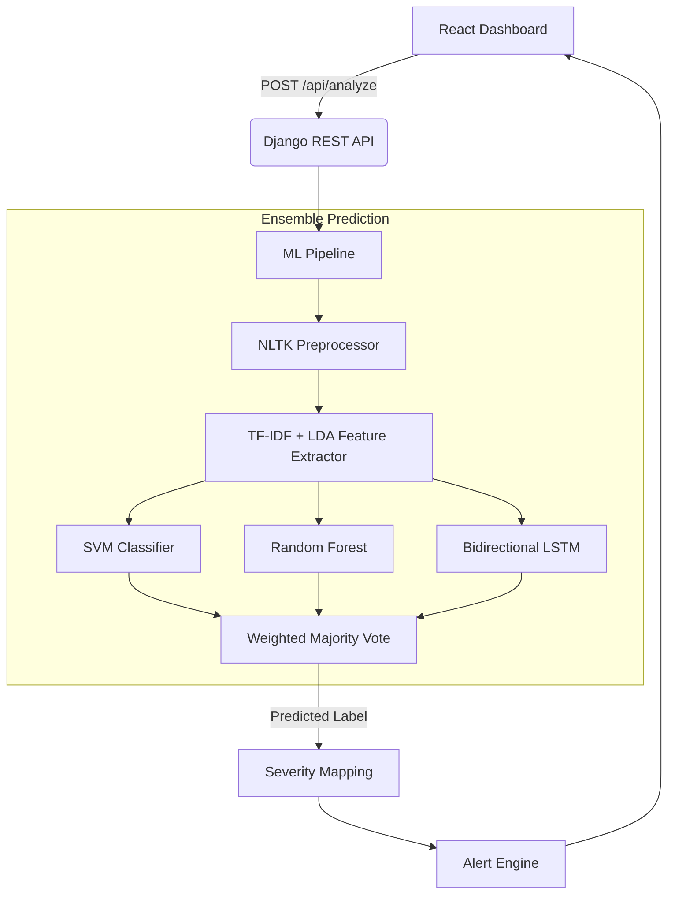

<h1 align="center">
  🧠 MindSense: AI Mental Stress Detection & Early Warning System
</h1>

<p align="center">
  <em>An end-to-end NLP system that detects mental health conditions from text using ensemble machine learning — trained on 68k+ Reddit posts.</em>
</p>

<p align="center">
  
  
  
  
  
</p>

> [!WARNING]
> This is a **research and portfolio project only**. It is NOT a medical diagnostic tool. Always consult a licensed mental health professional for clinical guidance.

---

## 🎯 What It Does

MindSense classifies text into **7 mental health categories** using an ensemble of 3 ML models, then maps the prediction to a severity score and triggers alerts for high-risk content.

| Category | Severity |
|---|---|
| Normal | 1 — Minimal |
| Personality Disorder | 2 — Mild |
| Anxiety | 3 — Moderate |
| Stress | 3 — Moderate |
| Bipolar | 4 — High ⚠️ |
| Depression | 4 — High ⚠️ |
| Suicidal | 5 — Critical 🚨 |

---

## 🏗️ Architecture



---

## 📊 Model Performance

Trained on **68,396 samples** merged from 3 datasets:

| Dataset | Samples | Source |
|---|---|---|
| Combined Data | 52,681 | 7-class mental health posts |
| Suicide Detection | 15,000 | Reddit SuicideWatch + Depression |
| Dreaddit | 715 | Reddit stress analysis |

| Model | Validation F1 | Ensemble Weight |
|---|---|---|
| **SVM** | **0.7498** | 0.75 |
| LSTM (Bi-LSTM) | 0.7312 | 0.73 |
| Random Forest | 0.6989 | 0.70 |

The **ensemble** (weighted probability averaging) combines all three for the most robust predictions.

---

## 💻 Tech Stack

- **Frontend:** React + Vite, Vanilla CSS, Recharts, Axios
- **Backend:** Django REST Framework, PostgreSQL/SQLite
- **ML:** Scikit-learn (SVM, Random Forest), PyTorch (Bi-LSTM), NLTK
- **NLP Features:** TF-IDF (15k features) + Latent Dirichlet Allocation (20 topics)
- **Infra:** Docker, Docker Compose, Nginx, Gunicorn

---

## ⚙️ Quick Start

### Option A: Docker (Recommended)

```bash
git clone git@github.com:Spectronyx/AI-Mental-Stress-Detection-System.git
cd AI-Mental-Stress-Detection-System
cp .env.example .env
docker compose up --build -d
```

- **Frontend:** http://localhost
- **API Docs:** http://localhost:8000/api/docs/

### Option B: Local Development

#### 1. Backend

```bash
cd backend
python -m venv venv
source venv/bin/activate  # Windows: venv\Scripts\activate
pip install -r requirements.txt
cp ../.env.example ../.env

# Download datasets into datasets/ folder (see below)
# Train the models
python ml/trainer.py --model all

# Run the server
python manage.py migrate --settings=config.settings.development
python manage.py runserver --settings=config.settings.development
```

#### 2. Frontend

```bash
cd frontend
npm install
npm run dev
```

- **Frontend:** http://localhost:5173
- **API:** http://localhost:8000

---

## 📁 Dataset Setup

The training datasets are **not included** in the repository (too large for Git). Download them and place in the `datasets/` folder:

| File | Size | Source |
|---|---|---|
| `Combined Data.csv` | 31 MB | [Kaggle](https://www.kaggle.com/) — Mental Health Classification |
| `Suicide_Detection.csv` | 160 MB | [Kaggle](https://www.kaggle.com/) — Suicide & Depression Detection |
| `dreaddit_StressAnalysis - Sheet1.csv` | 672 KB | [Dreaddit Paper](https://arxiv.org/abs/1911.00133) |

```
datasets/
├── Combined Data.csv
├── Suicide_Detection.csv
└── dreaddit_StressAnalysis - Sheet1.csv
```

---

## 📂 Project Structure

```
├── backend/
│   ├── apps/analysis/          # Django app (views, models, serializers)
│   ├── config/settings/        # Django settings (dev, prod)
│   ├── data/                   # Label schema + Original Reddit Data
│   ├── ml/                     # ML pipeline
│   │   ├── trainer.py          # Dataset merging & model training
│   │   ├── pipeline.py         # Ensemble inference orchestrator
│   │   ├── preprocessor.py     # NLTK text cleaning
│   │   ├── feature_extractor.py# TF-IDF + LDA feature extraction
│   │   ├── alert_engine.py     # Severity alerts & crisis resources
│   │   └── models/             # SVM, RF, LSTM model wrappers
│   ├── saved_models/           # Trained model artifacts (git-ignored)
│   └── requirements.txt
├── frontend/
│   ├── src/components/         # React components
│   └── src/services/           # API service layer
├── datasets/                   # Training data (git-ignored)
├── docker-compose.yml
├── Dockerfile.backend
├── Dockerfile.frontend
├── nginx.conf
├── .env.example
└── README.md
```

---

## ⚖️ Ethical Guidelines

- Hard-coded **crisis intervention resources** render immediately when severity ≥ 4
- PII scrubbing in the preprocessor pipeline
- Models always return **confidence scores** for transparency
- Clear disclaimer on every prediction

---

## 📄 License

This project is for educational and research purposes.

---

> _Built with Python, PyTorch, and a commitment to responsible AI._
